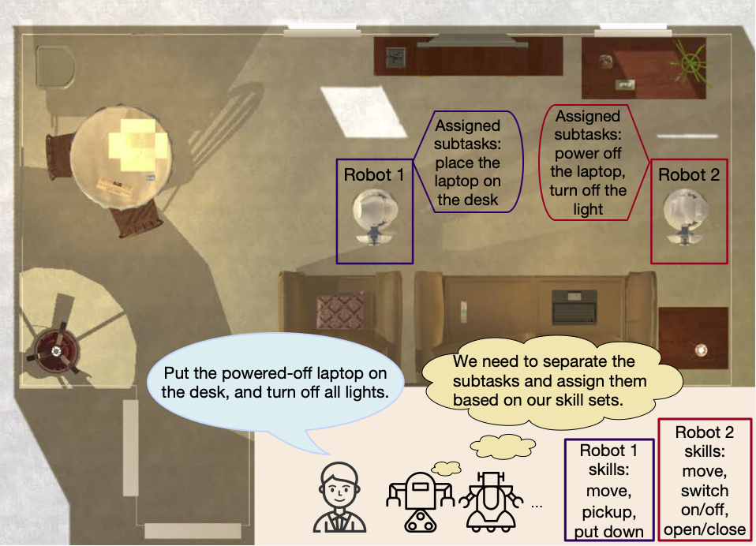

# **LaMMA-P Extended: Local LLM, PDDL and Constraint-Driven Multi-Robot Coordination**

This repository is an RBT3001 Robotics Project artefact built on top of the official LaMMA-P codebase. The student contribution adapts LaMMA-P for no-paid-API local LLM operation, adds a deterministic MILP allocation layer for heterogeneous multi-robot teams, and provides AI2-THOR video evidence of multi-agent task execution.

For examiners, start with [EXAMINER_README.md](EXAMINER_README.md).

## Verification Status

This artefact was prepared from the clean package `27047194_RBT3001_LaMMA_P_Artefact_CLEAN.zip` and repackaged as `27047194_RBT3001_LaMMA_P_Artefact_WINDOWS_WSL_VERIFIED.zip`.

Verified command results on `2026-05-02`:

- `bash scripts/setup_ubuntu.sh`: completed with graceful warnings when `sudo` and networked `pip` access were unavailable.
- `bash scripts/verify_ubuntu_pipeline.sh`: passed all non-GUI checks.
- `python3 scripts/constraint_optimizer.py --task-file data/final_test/FloorPlan15vague.json --output-dir outputs/optimizer/FloorPlan15vague`: passed with `greedy=21.06`, `optimised=18.209`, improvement `13.54%`.
- `python3 scripts/run_natural_command.py --command "put the apple and tomato in the fridge and switch off the light" --robots 1,2,3 --output-dir outputs/natural_command_demo`: passed with success proxy `1.0`.
- `python3 gazebo_demo/scripts/check_gazebo_assets.py`: passed.
- On Windows 11 + WSL2 Ubuntu with WSLg, `gz sim --versions` returned `8.11.0` and `bash gazebo_demo/scripts/run_gz_sim_demo.sh` launched Gazebo Sim successfully and executed the scripted mission playback.

Environment limitations during this verification pass:

- `gz` was not installed, so the Gazebo GUI mission could not be launched here.
- `glxinfo -B` failed with `unable to open display :1`, so GUI evidence could not be captured here.
- `python3 scripts/demo_ai2thor_video.py` could not be rerun here because `ai2thor` was not installable in this restricted environment, but bundled AI2-THOR evidence remains included under `outputs/ai2thor_demo/`.
- `python3 scripts/check_local_llm.py` could not reach a local endpoint here; local endpoint support remains implemented for Ollama/Open WebUI.

## Student Contribution Summary

- Local/Open WebUI/Ollama-compatible LLM interface added to the LaMMA-P planning scripts.
- No paid API key required when using a local OpenAI-compatible endpoint.
- Constraint-driven optimiser added in `scripts/constraint_optimizer.py`.
- AI2-THOR video demo added in `scripts/demo_ai2thor_video.py`.
- Typed natural-language command runner added in `scripts/run_natural_command.py`.
- Gazebo Sim demonstration assets added in `gazebo_demo/`.
- Verified outputs included under `outputs/`.
- Dissertation planning and writing support included under `docs/`.

Key verified result:

- Greedy allocation travel-cost proxy: `21.060`
- Optimised allocation travel-cost proxy: `18.209`
- Improvement: `13.54%`
- Optimised success proxy: `1.0`

## Original LaMMA-P Project Context

This is the official repository for the LaMMA-P codebase. It includes instructions for configuring and running LaMMA-P on the MAT-THOR datasets in the AI2-THOR simulator. It is accepted as a conference paper by the IEEE International Conference on Robotics and Automation (ICRA), Atlanta, 2025.


[Project Website](https://lamma-p.github.io/) | [Paper](https://arxiv.org/abs/2409.20560) | [Video](https://www.youtube.com/watch?v=1edDuJbk_uk)



**Abstract:** Language models (LMs) possess a strong capability to comprehend natural language, making them effective in translating human instructions into detailed plans for simple robot tasks. Nevertheless, it remains a significant challenge to handle long-horizon tasks, especially in subtask identification and allocation for cooperative heterogeneous robot teams. To address this issue, we propose a Language Model-Driven Multi-Agent PDDL Planner (LaMMA-P), a novel multi-agent task planning framework that achieves state-of-the-art performance on long-horizon tasks. LaMMA-P integrates the strengths of the LMs’ reasoning capability and the traditional heuristic search planner to achieve a high success rate and efficiency while demonstrating strong generalization across tasks. Additionally, we create MAT-THOR, a comprehensive benchmark that features household tasks with two different levels of complexity based on the AI2-THOR environment. The experimental results demonstrate that LaMMA-P achieves a 105% higher success rate and 36% higher efficiency than existing LM-based multi-agent planners.

## Code Organization
Below are the details of various important directories 
- `resources/`: Contains robot definitions and PDDL domain files
- `scripts/`: Main execution scripts adapted from [SMART-LLM](https://github.com/SMARTlab-Purdue/SMART-LLM)
- `data/`: Test datasets and example tasks extended from [SMART-LLM](https://github.com/SMARTlab-Purdue/SMART-LLM)
- `downward/`: Fast Downward planner from [Fast Downward](https://github.com/aibasel/downward/)

## Datasets
The repository includes various commands and robots with different skill sets for heterogeneous robot tasks:

- Test tasks: `data/final_test/`
- Robot definitions: `resources/robots.py`
- Floor plans: Refer to [AI2Thor Demo](https://ai2thor.allenai.org/demo) for layouts

## Environment Setup
### 1. Environment Setup

Create a conda environment or virtualenv:
```bash
python3 -m venv .venv
.venv/bin/python -m pip install --upgrade pip
.venv/bin/python -m pip install -r requirements.txt
```

On Ubuntu, the recommended setup is:

```bash
bash scripts/setup_ubuntu.sh
bash scripts/verify_ubuntu_pipeline.sh
```

On Windows 11 with WSL2 Ubuntu, run the same commands inside the Linux filesystem rather than under `/mnt/c`. If `sudo` and internet access are available, the script will install Python dependencies and Gazebo Sim automatically. If they are blocked, the setup script now continues with clear warnings so the optimiser/parser checks can still be run.

The original LaMMA-P project suggested Python 3.9. This artefact was verified with a local virtual environment and pinned `ai2thor==4.2.0` because newer AI2-THOR releases pointed to missing macOS simulator builds during testing.

Optional conda setup:
```bash
conda create -n lammap python=3.10
conda activate lammap
pip install -r requirements.txt
```

### 2. Fast Downward Planner Setup
The project requires the [Fast Downward Planner](https://github.com/aibasel/downward/). Follow these steps to set it up:

1. Clone the Fast Downward repository as a submodule:
```bash
git submodule update --init --recursive
cd downward
```

2. Build the planner:
```bash
./build.py
```

3. Verify the installation:
```bash
./fast-downward.py --help
```

### 3. Local LLM Setup

The extended project is designed to avoid paid APIs. Use a local OpenAI-compatible service such as Ollama or Open WebUI. See `configs/local_llm.env.example`.

Paid OpenAI API use is still possible, but it is not required for the submitted artefact.

## Quickstart

### 0. Local LLM / Open WebUI Mode
The project has been adapted so the LLM stages can use a local OpenAI-compatible service instead of paid APIs. See `configs/local_llm.env.example`.

Ollama example:
```bash
export LOCAL_LLM_BASE_URL=http://localhost:11434/v1
export LOCAL_LLM_API_KEY=local-no-key-required
.venv/bin/python scripts/pddlrun_llmseparate.py --floor-plan 6 --base-url "$LOCAL_LLM_BASE_URL" --gpt-version llama3.1:8b
```

Open WebUI example:
```bash
export LOCAL_LLM_BASE_URL=http://localhost:3000/api
export LOCAL_LLM_API_KEY=<open-webui-token-if-required>
.venv/bin/python scripts/pddlrun_llmseparate.py --floor-plan 6 --base-url "$LOCAL_LLM_BASE_URL" --gpt-version llama3.1:8b
```

### Local AI2-THOR Video Demo
This workspace includes a lightweight demo runner that does not require an OpenAI API key or Fast Downward. It launches AI2-THOR, runs two agents through pickup/carry/place tasks, and writes MP4 videos plus a small HTML gallery:

```bash
.venv/bin/python scripts/demo_ai2thor_video.py --scene FloorPlan1 --output-dir outputs/ai2thor_demo --fps 8
```

Generated outputs:
- `outputs/ai2thor_demo/video_agent_1.mp4`
- `outputs/ai2thor_demo/video_agent_2.mp4`
- `outputs/ai2thor_demo/video_top_view.mp4`
- `outputs/ai2thor_demo/index.html`
- `outputs/ai2thor_demo/preview_contact_sheet.jpg`

Bundled evidence currently included in this submission:

- `video_agent_1.mp4`: `268615` bytes
- `video_agent_2.mp4`: `273717` bytes
- `video_top_view.mp4`: `48393` bytes
- `preview_contact_sheet.jpg`: `960x810`

If `ai2thor` is not installed, `scripts/demo_ai2thor_video.py` now exits with a clear dependency message instead of a Python traceback.

### Constraint-Driven Optimisation Demo
The dissertation contribution is supported by a deterministic MILP allocation layer. It compares greedy allocation with an optimised allocation that respects robot skills, capacity, availability, battery proxy, and workload limits:

```bash
.venv/bin/python scripts/constraint_optimizer.py \
  --task-file data/final_test/FloorPlan15vague.json \
  --output-dir outputs/optimizer/FloorPlan15vague
```

Generated outputs:
- `outputs/optimizer/FloorPlan15vague/allocation_result.json`
- `outputs/optimizer/FloorPlan15vague/allocation_result.csv`

### Type a New Natural-Language Command
For a lightweight no-paid-API demonstration of new typed commands:

```bash
.venv/bin/python scripts/run_natural_command.py \
  --command "put the apple and tomato in the fridge and switch off the light" \
  --robots 1,2,3 \
  --output-dir outputs/natural_command_demo
```

This creates:
- `outputs/natural_command_demo/parsed_task.json`
- `outputs/natural_command_demo/allocation_result.json`
- `outputs/natural_command_demo/allocation_result.csv`

For a full local LLM route, run Open WebUI/Ollama and use `scripts/pddlrun_llmseparate.py` with `--base-url`.

### Gazebo Sim Demonstration
Gazebo requires an Ubuntu/Gazebo runtime. A Gazebo Sim world and mission playback route are included for Ubuntu or Windows 11 + WSL2 Ubuntu:

```bash
cd gazebo_demo
bash scripts/run_gz_sim_demo.sh
```

Full Ubuntu setup and verification:

```bash
bash scripts/setup_ubuntu.sh
bash scripts/verify_ubuntu_pipeline.sh
```

Local asset validation:

```bash
.venv/bin/python gazebo_demo/scripts/check_gazebo_assets.py
bash -n gazebo_demo/scripts/run_gz_sim_demo.sh
```

The Gazebo demo visualises the same typed command evidence used by `outputs/natural_command_demo`: robot1 carries apple to fridge, robot2 carries tomato to fridge, and robot3 moves to the light switch.

Verified status:

- Asset check: passed.
- Launcher shell syntax: passed.
- Live Gazebo Sim launch on Windows 11 + WSL2 Ubuntu: passed.
- Verified Gazebo Sim version: `8.11.0`.
- Environment/display evidence and notes: see `outputs/gazebo_demo/gazebo_launch_log.txt` and `outputs/gazebo_demo/gazebo_demo_notes.md`.

The Gazebo launcher now attempts to auto-discover the `/world/.../set_pose` service instead of assuming a single hard-coded path, which is more robust across Gazebo versions.

### 1. Generate PDDL Plans
To generate PDDL plans for tasks in AI2Thor floor plans, run:
```bash
python scripts/pddlrun_llmseparate.py --floor-plan <floor_plan_no>
```

Additional parameters:
- `--gpt-version`: Choose between 'gpt-3.5-turbo', 'gpt-4o', 'gpt-3.5-turbo-16k' (default: 'gpt-4o')
- `--prompt-decompse-set`: Set decomposition prompt set (default: 'pddl_train_task_decomposesep')
- `--prompt-allocation-set`: Set allocation prompt set (default: 'pddl_train_task_allocationsep')

The script will:
1. Decompose the high-level task into subtasks
2. Generate PDDL problem files for each subtask
3. Run the Fast Downward planner on each subtask
4. Combine the solutions into a complete plan

Output files are stored in the `logs` directory, organized by timestamp and task name.

### 2. Execute Plans in AI2Thor
To execute the generated plans in the AI2Thor environment:
Convert the target plan into code
```bash
python plantocode.py --logs-dir ./logs --validate-code

```
then, 
```bash
python scripts/execute_plan.py --command <log_folder_name>
```
Replace `<log_folder_name>` with the specific folder name in the `logs` directory containing your generated plan.

## Citation
If you find this work useful for your research, please consider citing:
```bibtex
@inproceedings{zhang2025lamma,
  title={LaMMA-P: Generalizable Multi-Agent Long-Horizon Task Allocation and Planning with LM-Driven PDDL Planner},
  author={Zhang, Xiaopan and Qin, Hao and Wang, Fuquan and Dong, Yue and Li, Jiachen},
  booktitle={2025 IEEE International Conference on Robotics and Automation (ICRA)},
  year={2025},
  organization={IEEE}
}
```

## Acknowledgement

We sincerely thank the researchers and developers for [SMART-LLM](https://github.com/SMARTlab-Purdue/SMART-LLM), [AI2THOR](https://github.com/allenai/ai2thor), and [Fast Downward](https://github.com/aibasel/downward/) for their amazing work.
