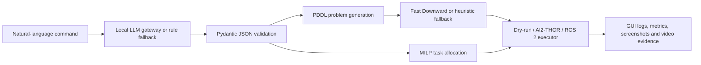

# Open LaMMA-R

Free local-LLM, PDDL and MILP-based multi-robot coordination for LIMO robots in AI2-THOR Floor 6 and ROS 2.

This is an independent repository. It is designed to run either locally for robotics/simulator work or in the cloud for the GUI, API, dry-run pipeline, evaluation and dissertation evidence.

## Originality Statement

Open LaMMA-R extends the LaMMA-P idea into a final-year robotics dissertation artefact by replacing paid cloud dependence with local LLMs, adding strict schema validation, generating explainable PDDL, integrating Fast Downward, adding a deterministic MILP allocation layer, providing a GUI dashboard, and keeping ROS 2/LIMO and AI2-THOR execution optional through robust dry-run fallbacks.

## Architecture



## Install

```bash
python -m venv .venv
source .venv/bin/activate
pip install -r requirements.txt
cp .env.example .env
```

On Windows PowerShell:

```powershell
python -m venv .venv
.\.venv\Scripts\Activate.ps1
pip install -r requirements.txt
Copy-Item .env.example .env
```

## Run Locally With Docker

```bash
cp .env.example .env
docker compose -f docker-compose.local.yml up --build
```

Open:

- GUI: `http://localhost:5173`
- API: `http://localhost:8000/api/status`

## Run In The Cloud

Use the deployment templates included in the repository:

- `backend/Dockerfile` for API container hosting.
- `frontend/Dockerfile` for a combined static frontend container.
- `render.yaml` for Render.
- `railway.json` for Railway backend deployment.
- `fly.toml` for Fly.io backend deployment.
- `docker-compose.cloud.yml` for a single cloud VM.

Cloud mode is intended for the API, GUI, JSON/PDDL/MILP dry-run pipeline and evaluation evidence. AI2-THOR, Gazebo, ROS 2 and LIMO hardware should normally run locally or on a robotics workstation.

See [DEPLOYMENT.md](DEPLOYMENT.md) and [LOCAL_AND_CLOUD_RUN.md](docs/setup_guides/LOCAL_AND_CLOUD_RUN.md).

## Local LLM Setup

Recommended:

```bash
ollama pull llama3.1:8b
ollama serve
```

The backend defaults to `LLM_PROVIDER=ollama`. If Ollama is unavailable, the demo uses the rule-based parser so the pipeline remains demonstrable.

## Main No-Server Demo

You do not need the GUI to demonstrate the project. The primary dissertation demo is now:

```powershell
.\scripts\run_floor6_ai2thor_video.ps1
```

or:

```bash
python scripts/run_floor6_ai2thor_video.py --open-video
```

This runs the Floor 6 mission, performs MILP allocation, records real AI2-THOR `FloorPlan6` frames to `docs/demo_video_script/floor6_ai2thor_demo.mp4`, and opens the MP4 in VLC when VLC is installed.

AI2-THOR does not ship with visible LIMO robot bodies and may not provide a working Windows build for every Unity commit. For visible LIMO robots, use the Gazebo/ROS 2 execution layer or add custom Unity robot assets. This repository avoids fake cartoon robot videos; if AI2-THOR cannot launch, the video script exits with a setup error instead of pretending.

## Optional Backend

```bash
python -m uvicorn backend.api.main:app --host 0.0.0.0 --port 8000 --reload
```

## Run Frontend

```bash
cd frontend
npm install
npm run dev
```

Open `http://localhost:5173`.

## Dry-Run Demo

```bash
python evaluation/run_experiments.py
```

This produces:

- `evaluation/results/results_metrics.csv`
- `evaluation/results/cv_summary.csv`
- `evaluation/results/ablation_results.csv`
- `evaluation/plots/*.png`

## Fast Downward

Install/build Fast Downward and set:

```bash
FAST_DOWNWARD_PATH=/path/to/fast-downward.py
```

If it is missing, the API returns a clear setup message and uses a deterministic heuristic plan for dry-run evidence.

## AI2-THOR Demo

Install AI2-THOR and run with a graphical display. The executor targets `FloorPlan6` and currently provides a safe placeholder mapping for PDDL actions. If AI2-THOR is unavailable, it falls back to dry-run mode.

## ROS 2/LIMO Notes

The dispatcher is ROS 2-ready but does not require ROS 2 to import. Without `rclpy`, it records mock Nav2-style dispatch logs. Connect it to LIMO robots by mapping `navigate` actions to Nav2 goals and object actions to manipulator or payload behaviours.

## Evaluation

The evaluator compares:

- LLM-only
- PDDL-only
- LLM + PDDL
- LLM + PDDL + MILP

Metrics include task success, malformed JSON rate, PDDL validity, planner success, allocation feasibility, travel cost, makespan, planning time, utility and recovery success.

## Evidence Checklist

- GUI screenshot showing command, JSON, PDDL, plan, MILP allocation and logs.
- Dry-run logs for the Floor 6 flagship mission.
- Results CSVs and plots.
- Fast Downward setup proof or fallback explanation.
- AI2-THOR/Gazebo screenshots if available.
- ROS 2 mock or real dispatch logs.
- Demo MP4 recorded with FFmpeg or VLC.
